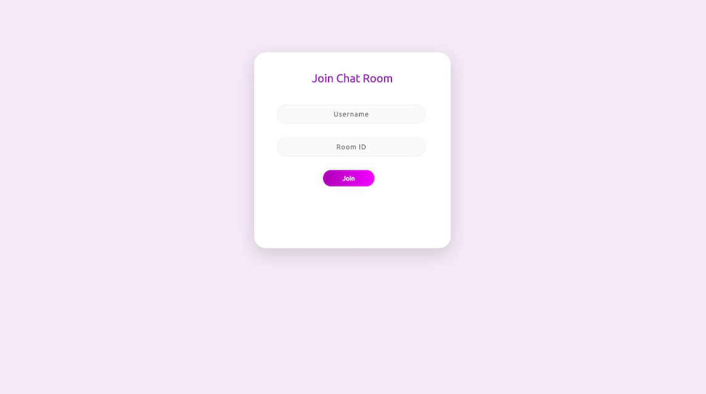

# Chat Room Website

### This is an implementation of Socket.io using Node.js.  A chat room made by using web sockets.
In this implementation users can join an existing Chatroom or can create a new one.  Every room is having a Room ID and the chat box keep track of all the users activity like entering or leaving the room.  The active room members are shown on left pane of the page. 
 

  <b> Login Page</b>

  

 
 

  <b>ChatRoom page</b>

  

